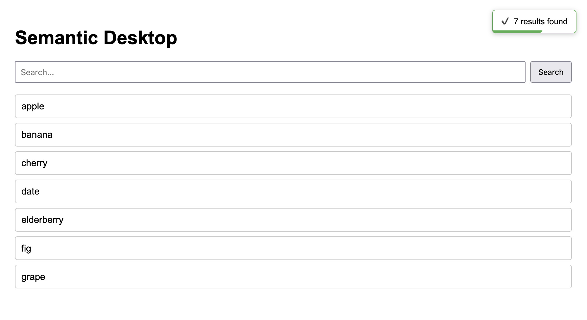

# Semantic Desktop Search


Semantic Desktop Search is a cross-platform desktop application built with
**React 18** and **Tauri**, featuring a fully custom inline toast
notification system for clean, modern user feedback.

------------------------------------------------------------------------

## ✨ Features

-   ⚛️ React 18 frontend (functional components + hooks)
-   🖥️ Native desktop packaging via Tauri
-   🔔 Custom inline toast system (no external toast libraries)
-   ⚡ Hot reload during development
-   📦 Cross-platform builds (macOS, Windows, Linux)

------------------------------------------------------------------------

## 🛠️ Prerequisites

-   Node.js 18+
-   Rust toolchain (required for Tauri)
-   Tauri OS prerequisites (see Tauri docs for your OS)
-   Optional: Python 3.10+ (if adding backend later)

------------------------------------------------------------------------

## 🚀 Quick Start (Development)

Clone the repository:

``` bash
git clone https://github.com/MiGzY/semantic-desktop-search.git
cd semantic-desktop
```

Make the launcher executable:

``` bash
chmod +x start.sh
```

Run everything with one command:

``` bash
./start.sh
```

This will:

-   Install frontend dependencies if needed
-   Start the React dev server
-   Launch the Tauri desktop window
-   Automatically clean up when you close the app

------------------------------------------------------------------------

## 📦 Production Build

Build the React frontend:

``` bash
cd frontend
npm install
npm run build
```

Build the desktop app:

``` bash
cd ..
npx tauri build
```

Your native application bundle will be generated inside the
`src-tauri/target` directory.

------------------------------------------------------------------------

## 🔔 Toast Notification System

The app includes a custom `ToastProvider`.

Usage inside any component:

``` js
const toast = useToast();
toast("Operation successful!", "success");
```

Supported types:

-   success
-   error
-   info

Features:

-   Auto-dismiss with animated progress bar
-   Click-to-dismiss
-   Slide-out exit animation
-   Position configurable (top-right, bottom-left, etc.)

------------------------------------------------------------------------

## 📂 Project Structure

    semantic-desktop/
    ├─ README.md
    ├─ frontend/
    │  ├─ src/
    │  │  ├─ App.jsx
    │  │  ├─ ToastProvider.jsx
    │  │  └─ api.js
    │  └─ public/
    ├─ src-tauri/
    │  ├─ tauri.conf.json
    │  └─ Cargo.toml
    └─ start.sh

------------------------------------------------------------------------

## 🖼️ Screenshots

    

------------------------------------------------------------------------

## 📌 Notes

-   Always use `start.sh` during development.
-   Do not run Tauri before the frontend dev server is available.
-   Backend integration (FastAPI or similar) can be added later.
-   use stop-servers.sh to kill the server running on port 3000.

------------------------------------------------------------------------

## 🚀 Releasing

See the full release checklist here:

[Release Checklist](./RELEASE_CHECKLIST.md)

## 📜 License

MIT License

Copyright (c) 2026 Miguel Manzano

Permission is hereby granted, free of charge, to any person obtaining a copy
of this software and associated documentation files (the "Software"), to deal
in the Software without restriction, including without limitation the rights
to use, copy, modify, merge, publish, distribute, sublicense, and/or sell
copies of the Software, and to permit persons to whom the Software is
furnished to do so, subject to the following conditions:

The above copyright notice and this permission notice shall be included in all
copies or substantial portions of the Software.

THE SOFTWARE IS PROVIDED "AS IS", WITHOUT WARRANTY OF ANY KIND, EXPRESS OR
IMPLIED, INCLUDING BUT NOT LIMITED TO THE WARRANTIES OF MERCHANTABILITY,
FITNESS FOR A PARTICULAR PURPOSE AND NONINFRINGEMENT. IN NO EVENT SHALL THE
AUTHORS OR COPYRIGHT HOLDERS BE LIABLE FOR ANY CLAIM, DAMAGES OR OTHER
LIABILITY, WHETHER IN AN ACTION OF CONTRACT, TORT OR OTHERWISE, ARISING FROM,
OUT OF OR IN CONNECTION WITH THE SOFTWARE OR THE USE OR OTHER DEALINGS IN THE
SOFTWARE.
